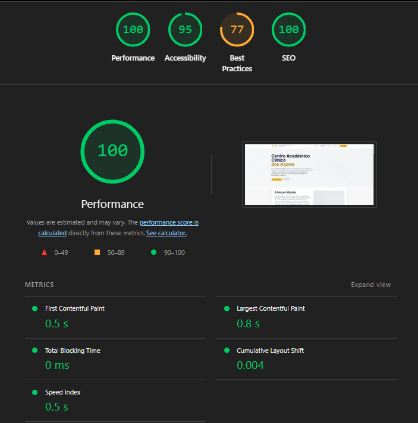

# Projeto TE1 - Fase 2 (PI2) - Landing page do Centro Académico Clínico dos Açores (CACA)

Este repositório contém o código-fonte e a documentação referente à **segunda fase (PI2)** do projeto da unidade curricular de Tecnologias Web.

A documentação da primeira fase (PI1) pode ser consultada em [README-PI1.md](./README-PI1.md).

## a) Identificação do grupo (PI2)

- Adriano Furtado Arruda - 2024111815
- Puțan Iulia Nicoleta - 2025128950
- David Jorge Repolho Cardoso - 2024108757

## Distribuição de Tarefas

Com base na proposta de distribuição de trabalho, as responsabilidades foram divididas da seguinte forma:

### Puțan Iulia Nicoleta
**Responsabilidade Principal:** Formulário e Validação (Interação do utilizador e recolha de dados).
- Adicionar um formulário à landing page (ex: secção "Mais Informações" ou "Newsletter").
- Incluir pelo menos três campos diferentes (nome, email, mensagem).
- Implementar validação JavaScript para garantir o preenchimento dos campos obrigatórios.
- Validar formatos específicos (ex: endereço de email correto).
- Fornecer feedback visual através de mensagens de erro ou sucesso.
- Simular uma submissão bem-sucedida exibindo uma mensagem de confirmação.

### David Jorge Repolho Cardoso
**Responsabilidade Principal:** Animações e Bibliotecas Externas (Melhoria do apelo visual).
- Implementar pelo menos duas animações diferentes relevantes para o contexto do projeto.
- Integrar uma biblioteca externa com propósito justificado (ex: D3.js, Three.js, GSAP).
- Programar gatilhos (triggers) para animações (ex: ao carregar a página ou ao fazer scroll).

### Adriano Furtado Arruda
**Responsabilidade Principal:** Gestão de Eventos e Interatividade (Navegação e interação da página).
- Implementar pelo menos três eventos JavaScript diferentes (excluindo submissão de formulário).
- Exemplos de funcionalidades: botão "Saber Mais" que revela conteúdo oculto, carrossel de imagens navegável, botão "Voltar ao Topo", efeitos hover complexos.

### Responsabilidades Partilhadas
- **Acessibilidade:** Garantir que todas as funcionalidades são utilizáveis por diferentes utilizadores.
- **Integração:** Manter a semântica HTML adequada e garantir o design responsivo.
- **Documentação:** Escrita colaborativa do ficheiro README.md.

## b) Descrição do Projeto (Fase 2)

O objetivo principal desta fase foi a **melhoria interativa e dinâmica da landing page** do CACA, enriquecendo a experiência do utilizador através da integração de JavaScript.

### Objetivos e Funcionalidades Implementadas:

1.  **Formulário de Contacto/Inscrição (Interatividade):**
    -   Implementação de um formulário funcional (ex: "Mais Informações" ou "Newsletter").
    -   Validação do lado do cliente (client-side) com JavaScript.
    -   Feedback visual imediato (mensagens de erro e sucesso).
    -   Simulação de submissão de dados.

2.  **Animações (Dinamismo):**
    -   Integração de animações contextuais relevantes para o CACA.
    -   Uso de bibliotecas externas (ex: D3.js, Three.js, GSAP) ou CSS/JS nativo.
    -   Animações acionadas por eventos (scroll, load, etc.).

3.  **Gestão de Eventos (Usabilidade):**
    -   Implementação de eventos JavaScript para responder a interações do utilizador.
    -   Funcionalidades como botões "Saber Mais", efeitos hover avançados, carrosséis ou botões "scroll-to-top".

4.  **Qualidade e Boas Práticas:**
    -   Código JavaScript modular e organizado.
    -   Foco na acessibilidade e semântica HTML.
    -   Design responsivo mantido e aprimorado.

## c) Identidade Visual e Design

A identidade visual mantém a coerência com a fase anterior, focando-se em transmitir confiança e profissionalismo no contexto clínico-académico.

## d) Acessibilidade e Responsividade

Continuamos a garantir as boas práticas de acessibilidade e responsividade:
- Uso correto de tags semânticas.
- Atributos `alt` em imagens.
- Contraste adequado.
- Layout responsivo para diferentes dispositivos.

---

## Benchmarking (Fase 2)

### Resultados do Benchmark

[Insira aqui a imagem ou descrição dos resultados de benchmark da nova versão, se aplicável]

---

# TE1 Project - Phase 2 (PI2) - Azores Academic Clinical Center (CACA) Landing Page

This repository contains the source code and documentation for the **second phase (PI2)** of the Web Technologies course project.

Documentation for the first phase (PI1) can be found in [README-PI1.md](./README-PI1.md).

## a) Group Identification (PI2)

- Adriano Furtado Arruda - 2024111815
- Puțan Iulia Nicoleta - 2025128950
- David Jorge Repolho Cardoso - 2024108757

## Task Distribution

Based on the work distribution proposal, responsibilities were divided as follows:

### Puțan Iulia Nicoleta
**Main Responsibility:** Form and Validation (User interaction and data collection).
- Add a form to the landing page (e.g., 'More Information' or 'Newsletter' section).
- Include at least three different fields (name, email, message).
- Implement JavaScript validation to ensure required fields are completed.
- Validate specific formats (e.g., correct email address).
- Provide visual feedback through error or success messages.
- Simulate a successful submission by displaying a confirmation message.

### David Jorge Repolho Cardoso
**Main Responsibility:** Animations and External Libraries (Improving visual appeal).
- Implement at least two different animations relevant to the project context.
- Integrate an external library with a justified purpose (e.g., D3.js, Three.js, GSAP).
- Program triggers for animations (e.g., page load events or scroll actions).

### Adriano Furtado Arruda
**Main Responsibility:** Event Management and Interactivity (Navigation and page interaction).
- Implement at least three different JavaScript events (excluding form submission).
- Functionality examples: 'Learn More' button revealing hidden content, navigable image carousel, 'Scroll to Top' button, complex hover effects.

### Shared Responsibilities
- **Accessibility:** Ensure all features are usable by different users.
- **Integration:** Maintain proper HTML semantics and ensure responsive design.
- **Documentation:** Collaboratively write the README.md file.

## b) Project Description (Phase 2)

The main goal of this phase was the **interactive and dynamic improvement of the CACA landing page**, enriching the user experience through the integration of JavaScript.

### Objectives and Implemented Features:

1.  **Contact/Subscription Form (Interactivity):**
    -   Implementation of a functional form (e.g., "More Information" or "Newsletter").
    -   Client-side validation using JavaScript.
    -   Immediate visual feedback (error and success messages).
    -   Data submission simulation.

2.  **Animations (Dynamism):**
    -   Integration of contextual animations relevant to CACA.
    -   Use of external libraries (e.g., D3.js, Three.js, GSAP) or native CSS/JS.
    -   Event-triggered animations (scroll, load, etc.).

3.  **Event Management (Usability):**
    -   Implementation of JavaScript events to respond to user interactions.
    -   Features such as "Learn More" buttons, advanced hover effects, carousels, or "scroll-to-top" buttons.

4.  **Quality and Best Practices:**
    -   Modular and organized JavaScript code.
    -   Focus on accessibility and HTML semantics.
    -   Responsive design maintained and improved.

## c) Visual Identity and Design

The visual identity maintains consistency with the previous phase, focusing on conveying trust and professionalism in the clinical-academic context.

## d) Accessibility and Responsiveness

We continue to ensure good practices for accessibility and responsiveness:
- Correct use of semantic tags.
- `alt` attributes on images.
- Adequate contrast.
- Responsive layout for different devices.
